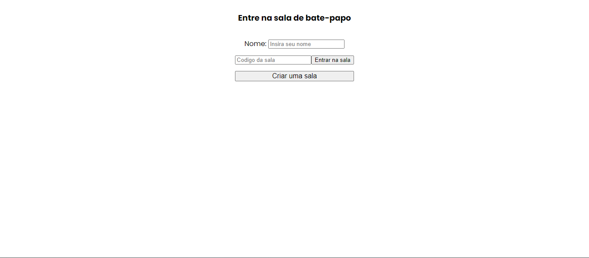
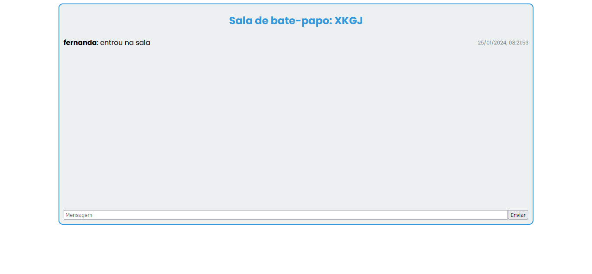
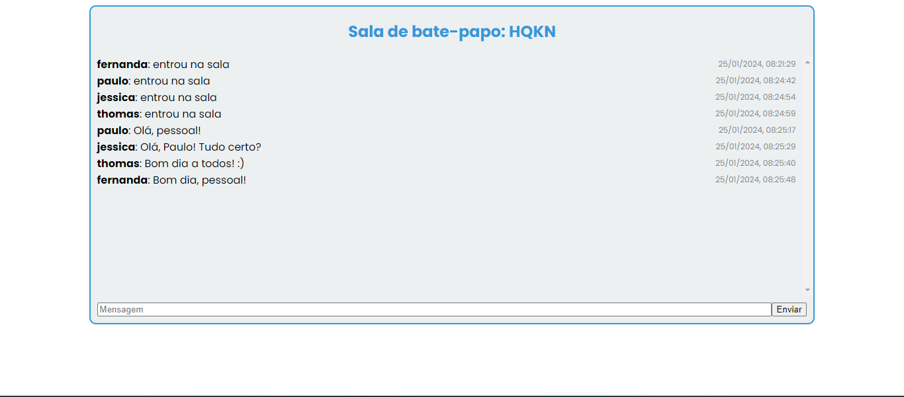
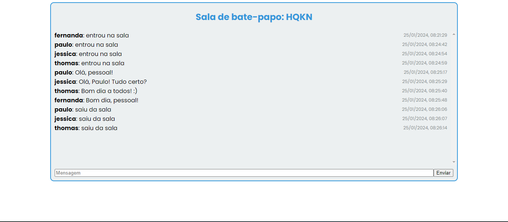

# Aplicação de Bate-Papo em Tempo Real com Flask e Socket.IO


## Visão geral

Esta é uma aplicação simples de bate-papo em tempo real construída usando Python, Flask e Socket.IO. A aplicação permite que os usuários criem ou participem de salas de bate-papo e participem de conversas em tempo real.


## Demostração do projeto


## Como Funciona

1. **Execução do Servidor:**
   - O servidor é iniciado utilizando o Flask e o Flask-SocketIO.
   - As rotas são definidas para a página inicial (`/`) e para a sala de bate-papo (`/room`).
   - A comunicação em tempo real é habilitada para lidar com eventos de mensagens, conexão e desconexão.




2. **Página Inicial:**
   - Os usuários acessam a página inicial e inserem seus nomes.
   - Eles têm a opção de criar uma nova sala ou inserir o código de uma sala existente para participar.




3. **Criação ou Entrada em uma Sala:**
   - Se um usuário opta por criar uma nova sala, um código único é gerado.
   - Se um usuário opta por entrar em uma sala existente, o código é verificado para garantir que a sala exista.




4. **Sala de Bate-Papo:**
   - Os usuários são redirecionados para a sala de bate-papo onde podem interagir com outros participantes.
   - Mensagens são enviadas em tempo real para todos os membros da sala.




5. **Conexão/Desconexão:**
   - Quando um usuário entra na sala, uma notificação é enviada para informar os outros membros.
   - Quando um usuário sai, uma notificação de saída é enviada.


## Ferramentas utilizadas:
     - Flask
     - Flask-SocketIO
     - Python 3.x


## Como utilizar a aplicação?

1. Clone o repositório:

   ```bash
   git clone https://github.com/mattheusp/Chat-AoVivo-Python_


## Estrutura de Arquivos

- main.py: Script principal da aplicação.
- templates/home.html: Modelo HTML para a página inicial.
- templates/room.html: Modelo HTML para a sala de bate-papo.
- requirements.txt: Lista de dependências Python.

### Contato ✉️

- E-mail: mattheusp382@gmail.com
- LinkedIn: [Mattheus-Pereira](https://www.linkedin.com/in/mattheuspereira/)
- Portfólio: [mtp-dev.com](https://mtpdev.com.br/)

### Contribuição 🤝

Se você quiser contribuir com um projeto ou encontrar um problema, sinta-se à vontade para abrir um novo problema ou enviar uma solicitação pull. Qualquer contribuição é bem-vinda!

### Licença📄

Este portfólio está licenciado sob a [Licença MIT](https://opensource.org/licenses/MIT).